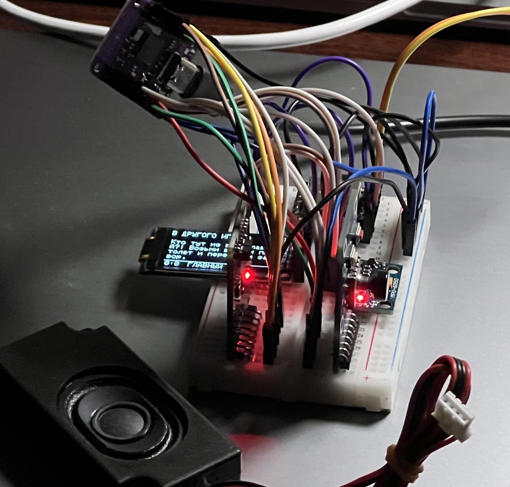

# Детка Рулетка

Игра в рулетку в одном девайсе.

## Геймплей

Игрушка выполнена в форме пистолета, схожего с GLock.
В ней есть динамик, экран и джойстик для взаимодействия.

Аккумулятор находится в магазине. Поэтому игра начинается вставкой магазина в пистолет.

В игрушке есть виртуальная ведущая, которая рассказывает правила и определяет порядок действий.
Ведущая говорит голосом через динамик, а на экране дополнительно отображается текст (доступность).
Экран также показывает и прочий игровой статус.

В игрушке есть несколько датчиков:

- датчик отвода затвора
- датчик выстрела (курок)
- датчик целеуказания (акселерометр)

Для управления интерфейсом предусмотрен джойстик на месте флажка затворной задержки (под большим пальцем).

Чтобы понять, на кого направлен пистолет, используется два положения акселерометра:

- ствол прямо - в другого игрока
- ствол вверх - в себя

Игровые бонусы - это физические карты. Они выполнены в виде RFID-карт с нанесенным рисунком бонуса.
Для их чтения в устройстве размещается MFRC522 модуль.

Ведущая подсказывает, когда и сколько нужно брать карт.
Дополнительно она следит за тем, чтобы не было обмана: количество и типы вышедших карт.

## Компоненты

- `ESP32` S2 mini - контроллер
- `DFPlayer` - mp3-плеер на SD-карте
- `MPU-6050` - акселерометр+гироскоп
- `MFRC522 mini` - считыватель карт
- `GME64128-02` - OLED дисплей

## Архитектура

Проект написан на MicroPython.

Точка входа - `boot.py`. В этом скрипте создаются подключения к периферии и выполняется инициализация моделей.

Игровая логика описана в `game.py`. Модель включает в себя несколько вложенных.

Используется кастомный способ хранения русских шрифтов. Они описаны в `font.py`. Для их корректной отрисовки в `sh1107.py` добавлен метод `text_area()`.

> Некоторые вещи остаются сделанными на коленке.

## Корпус (в процессе)

Разрабатывается в https://cad.onshape.com

## ПРОБЛЕМЫ

- Как прерывать задачи в asyncio?
  Метод из примера не работает в плеере.
  Из-за этой ошибки не удается прерывать играющее аудио.
- Перестал работать модуль DFPlayer. Скорей всего это электрическая проблема конкретно.

## Инструменты

### Live Reload

Следит за изменениями py-файлов и выполняет автоматическую загрузку на устройство. После загрузки, код перезагружается.

`node scripts/live-reload.js -p /dev/cu.usbmodem1234561`

### Продолжительность аудио

Измеряет продолжительность аудио-дорожек.

`sh scripts/durations.sh`

## Reference

Вдохновлено Buckshot Roulette ❤️
